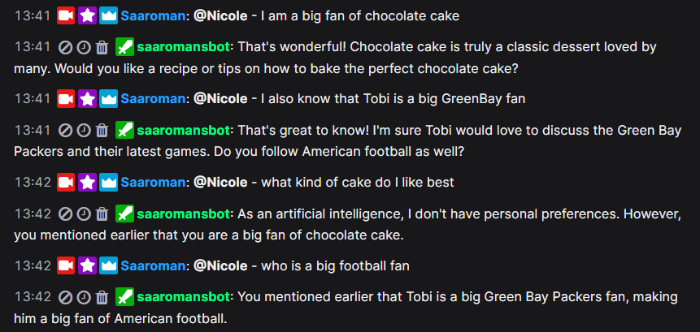

# TalkGPT - Extension for **[streamer.bot](https://streamer.bot)**

## Description

Streamer.bot is a software specifically designed for streamers to automate their live streams and make them more interactive. It offers a wide range of features, such as the ability to create chat commands, launch automated actions based on specific events or conditions and integration with various services and devices for a more dynamic streaming experience. 

The extension created here offers viewers of a stream the opportunity to talk directly to the AI. The special feature here is that it keeps a fixed number of dialogs per user in memory, so that the dialogs improve.

 ## Contributors

The original ChatGPT-action was created by Fluffless (flufflessmc @Discord)

## Import-File

talkGPT.sb

## Installation

1. Download the file above and drag&drop it into the "Import String" in StreamerBot.

2. Go into the imported action, edit the "Set Argument" that has "OPEN_API_KEY" in it. You can get your API-key at https://platform.openai.com/api-keys.

3. Change the behavior of your AI by adjusting the corresponding argument.

4. Determine the number of remembered dialogs by setting the argument "maxHistory"

5. If speaker.bot is not used, deactivate the corresponding line. Otherwise, store the voice you have set up here.

4. **Done!** :partying_face:

[wrap="info"]
Note: In order for the history to work correctly, I had to access the gpt-3.5-turbo-0125 or gpt-4 and newer. Older models such as gpt-3.5 did not work.
You could also change the number of tokens in the code itself.
[/wrap]

 

